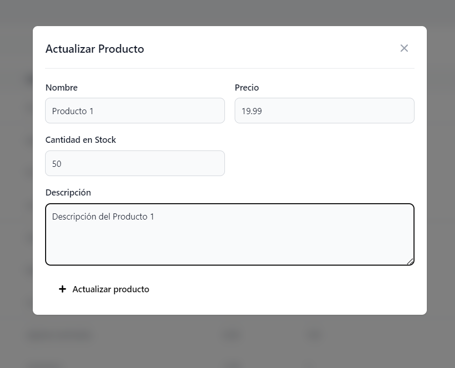

# Prueba Técnica
Ing. Giancarlo Culcay  
Finalizado con todos los objetivos cumplidos!  
Link Proyecto: https://prueba-iste-culcay.vercel.app/

Imágenes:  




## Proyecto
Este Proyecto esta desarrollado en Next.js y usa la base de datos PostgreSQL que esta alojada en [Vercel](https://vercel.com/docs/storage/vercel-postgres) y hace uso del plan gratuito.

Api de productos: https://prueba-iste-culcay.vercel.app/api/products  


Primero:

Copia ```.env.development.local.example``` como ```.env.development.local``` y llena las variables de ambiente

Luego:

```bash
npm run dev
# or
yarn dev
# or
pnpm dev
```

Abre [http://localhost:3000](http://localhost:3000) con tu navegador para ver el resultado

## SQL
Se crea la tabla al visitar ```/api/create-products-table```  

Sobre la Prevención de Inyección SQL, las librerías de Vercel usadas ya normalizan la información


fuente: https://vercel.com/docs/storage/vercel-postgres/quickstart